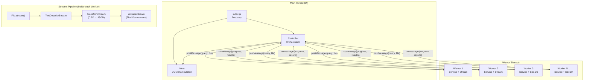
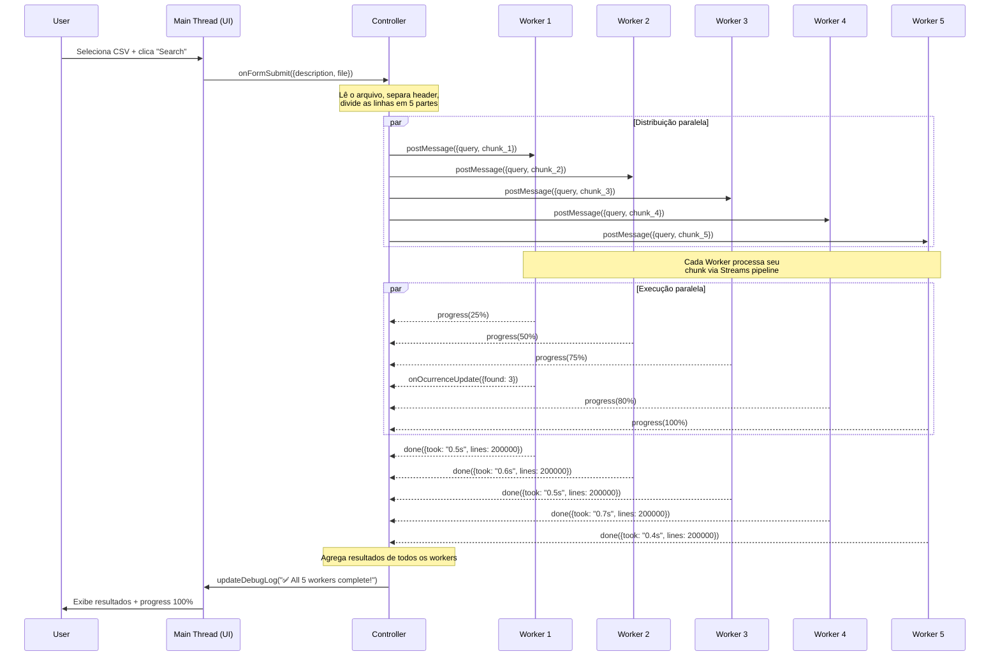
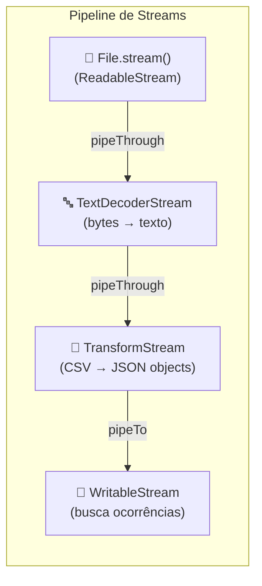
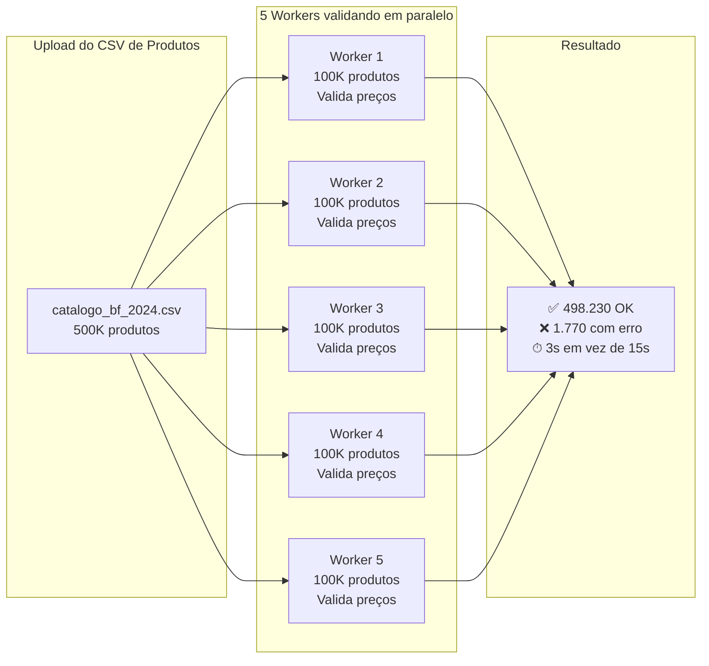
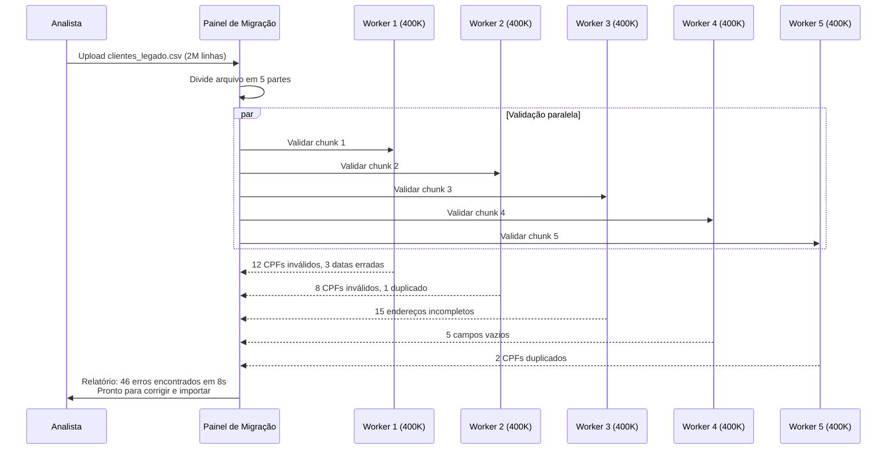
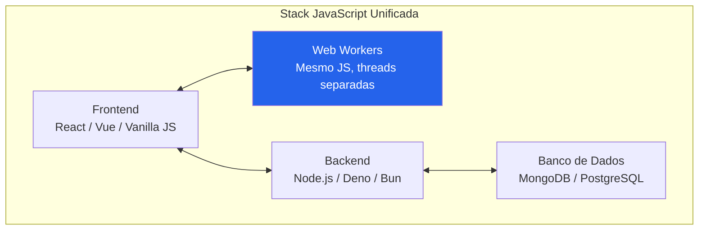

# 🧵 Multithreading & Streams — CSV Processor

Processador de arquivos CSV no **front-end** usando **Web Workers** (multi-threading) e **Streams API**, demonstrando como distribuir trabalho pesado entre múltiplas threads sem bloquear a interface do usuário.

> Baseado em [Erick Wendel](https://www.youtube.com/@ErickWendelTraining)

---

## 📐 Arquitetura

O projeto segue o padrão **MVC** com separação clara de responsabilidades:



| Arquivo | Responsabilidade |
|---|---|
| `index.js` | Bootstrap — instancia View, Service e inicializa o Controller |
| `controller.js` | Orquestra View ↔ Workers, distribui o arquivo, agrega resultados |
| `service.js` | Pipeline de Streams: `File → TextDecoder → CSV→JSON → FindOccurrences` |
| `view.js` | Manipulação do DOM (form, progress bar, debug log) |
| `worker.js` | Executa o Service em thread separada via Web Worker |

---

## 🔄 Como os Web Workers Funcionam

### O Problema: Single Thread

JavaScript no browser roda em uma **única thread** (a Main Thread). Se você processar um CSV de 1 milhão de linhas na Main Thread, a interface **congela** — o botão não responde, a progress bar trava, e o usuário pensa que a aplicação quebrou.

### A Solução: Web Workers

Web Workers permitem rodar código JavaScript em **threads separadas**, sem bloquear a UI. A comunicação entre a Main Thread e os Workers é feita via **message passing** (`postMessage` / `onmessage`).



### Regras dos Web Workers

| Característica | Detalhe |
|---|---|
| **Isolamento** | Workers não acessam o DOM, `window`, ou `document` |
| **Comunicação** | Apenas via `postMessage()` / `onmessage` (dados serializados) |
| **Transferência** | Arquivos (`File`, `Blob`) podem ser transferidos sem cópia |
| **Ciclo de vida** | Criados com `new Worker()`, encerrados com `worker.terminate()` |
| **Módulos** | Suportam `type: "module"` para `import`/`export` (Chrome) |

---

## 🌊 Como os Streams Funcionam

Streams permitem processar dados **em pedaços (chunks)** conforme chegam, em vez de carregar tudo na memória.



**Cada chunk passa pela pipeline assim:**

```
Chunk de bytes → "SL2016,01/01/2016,VEHICLE THEFT,..." → {case: "SL2016", description: "VEHICLE THEFT"} → found["THEFT"]++
```

### Buffer de Linhas Cortadas

Quando um chunk chega, ele pode cortar uma linha no meio:

```
Chunk 1: "...THEFT,5XX S 900 E\nSL2016117,01/01/20"  ← linha cortada!
Chunk 2: "16,DOMESTIC/PHYSICAL..."                      ← continuação
```

O `TransformStream` usa um **buffer `remainder`** que guarda o pedaço incompleto e o prepende ao próximo chunk, garantindo integridade dos dados.

---

## 📊 Ganhos de Performance

### Single Thread vs Multi-Thread

```mermaid
gantt
    title Processamento de 1M linhas de CSV
    dateFormat ss
    axisFormat %S s

    section Single Thread
    Processar 1M linhas      :a1, 00, 10s

    section 5 Workers
    Worker 1 (200K linhas)   :b1, 00, 2s
    Worker 2 (200K linhas)   :b2, 00, 2s
    Worker 3 (200K linhas)   :b3, 00, 2s
    Worker 4 (200K linhas)   :b4, 00, 2s
    Worker 5 (200K linhas)   :b5, 00, 2s
```



| Métrica | 1 Thread | 5 Threads | Ganho |
|---|---|---|---|
| **UI responsiva?** | ❌ Congela | ✅ Sempre fluida | ∞ |
| **Tempo teórico** | T | ~T/N | ~5x mais rápido |
| **Uso de CPU** | 1 core | Até 5 cores | Melhor utilização |
| **Memória** | Streams minimizam | Streams em cada worker | Similar |

> ⚠️ Os ganhos reais dependem do número de cores da CPU e do overhead de criação/comunicação dos workers. Para arquivos pequenos, o overhead pode ser maior que o ganho.

---

## 🏢 Casos de Uso Reais

### 🛒 Black Friday — Validação de Catálogo em Massa

Um e-commerce se prepara para a **Black Friday**. O time de operações precisa validar o CSV de **500 mil produtos** antes de publicar: preços corretos, descontos aplicados, estoque disponível, categorias válidas.



**O cenário sem Workers:** o analista faz upload do CSV no painel admin, a tela congela por 15 segundos, ele não sabe se funcionou, clica de novo, e o processamento reinicia. Com Workers, a progress bar avança em tempo real e o resultado aparece em 3 segundos — crítico quando faltam horas para a virada da Black Friday.

---

### 🔄 Migração de Dados — De Sistema Legado para Novo

Uma empresa está migrando de um **ERP legado** para um novo sistema. O time de TI exportou a base de clientes em CSV: **2 milhões de registros** com nome, CPF, endereço, histórico de compras. Antes de importar, precisam validar e transformar os dados no front-end:

- CPFs inválidos ou duplicados
- Endereços incompletos
- Datas em formato errado (`DD/MM/YYYY` → `YYYY-MM-DD`)
- Campos obrigatórios vazios



**Por que no front-end?** O analista pode iterar rapidamente — corrigir o CSV no Excel, re-fazer upload, validar de novo — sem sobrecarregar o servidor. O processamento pesado fica no browser do usuário.

---

### 🚔 Análise de Logs de Incidentes Policiais

Uma **central de monitoramento urbano** recebe diariamente CSVs com milhões de registros de ocorrências policiais (como o dataset deste projeto). Um analista precisa responder:

> *"Quantos roubos de veículo (VEHICLE THEFT) ocorreram nesta região?"*

| | Sem Workers | Com 5 Workers + Streams |
|---|---|---|
| **Tempo** | 30+ segundos | ~6 segundos |
| **UI** | ❌ Congela | ✅ Responsiva |
| **Progress** | Nenhum feedback | Barra em tempo real |
| **Experiência** | Clica de novo achando que travou | Sabe exatamente quanto falta |

---

## 💡 Por que JavaScript?

Você pode pensar: *"Por que não fazer isso no backend com Python, Java, ou Go?"*

A resposta está no **contexto do sistema**. Se sua aplicação já roda em JavaScript — e a maioria das aplicações web modernas roda — usar Workers é uma extensão natural do que você já tem:

### 1. **Mesma linguagem, zero atrito**



O `service.js` que roda dentro do Worker é **o mesmo código** que poderia rodar na Main Thread ou em um servidor Node.js. Não precisa aprender outra linguagem, outro paradigma, ou manter dois codebases.

### 2. **Processamento no cliente, economia no servidor**

Em cenários como **Black Friday** ou **migração de dados**, o processamento pesado acontece no **browser do usuário**. Isso significa:

- ✅ **Zero custo de servidor** para processar CSVs
- ✅ **Dados sensíveis** (CPF, endereços) não saem da máquina do usuário  
- ✅ **Escala horizontal grátis** — cada usuário processa no próprio hardware
- ✅ **Sem filas** — não compete por recursos do backend

### 3. **Equipe já conhece**

| Cenário | Custo |
|---|---|
| Treinar dev JS a usar Workers | ⏱ 1-2 horas (é a mesma linguagem) |
| Treinar dev JS a usar Go/Rust para processamento | ⏱ Semanas/meses |
| Manter microserviço em Go só para processar CSV | 💰 Infra + deploy + monitoramento |
| Workers no browser | 💰 R$ 0,00 de infra |

### 4. **Ecossistema maduro**

A Web Workers API é suportada em **todos os browsers modernos** desde 2010. Streams API desde 2016. Não é tecnologia experimental — é o padrão da plataforma web.

| API | Chrome | Firefox | Safari | Edge |
|---|---|---|---|---|
| Web Workers | ✅ 4+ | ✅ 3.5+ | ✅ 4+ | ✅ 12+ |
| Streams API | ✅ 43+ | ✅ 65+ | ✅ 10.1+ | ✅ 14+ |
| Worker Modules | ✅ 80+ | ✅ 114+ | ✅ 15+ | ✅ 80+ |

---

## 📖 Code Review — The Art of Readable Code

O código deste projeto passou por um **code review** guiado pelo livro **["The Art of Readable Code"](https://www.oreilly.com/library/view/the-art-of/9781449318482/)** de **Dustin Boswell & Trevor Foucher** (O'Reilly).

### Por que este livro?

Em projetos que usam conceitos avançados como **Streams**, **Web Workers** e **message passing**, o código tende a ficar complexo rapidamente. O livro foca exatamente nisso: **tornar código complexo fácil de entender por qualquer pessoa** — não apenas por quem o escreveu.

Diferente de livros que focam em arquitetura ou design patterns, *The Art of Readable Code* trata do **nível micro**: nomes de variáveis, estrutura de loops, expressões, e comentários. São melhorias pequenas que, somadas, fazem a diferença entre um código que o time **lê** e um que o time **decifra**.

### Melhorias Aplicadas

| # | Princípio do Livro | Antes | Depois |
|---|---|---|---|
| 1 | **Nomes específicos** (Cap. 2) | `#findOcurrencies` (typo + vago) | `#countOccurrences` |
| 2 | **Evitar nomes genéricos** (Cap. 2) | `l`, `dps`, `args`, `progressFn` | `line`, `dependencies`, `result`, `reportProgress` |
| 3 | **Nomes sem ambiguidade** (Cap. 3) | `updateDebugLog(text, reset)` | `updateDebugLog(text, { append })` |
| 4 | **Unidades no nome** (Cap. 2) | `totalUploaded`, `totalBytes` | `totalUploadedBytes`, `fileSizeBytes` |
| 5 | **Variáveis explicativas** (Cap. 8) | `(100 / totalBytes) * totalUploaded` | `(totalUploadedBytes / fileSizeBytes) * 100` |
| 6 | **Extrair subproblemas** (Cap. 10) | CSV parsing duplicado em `transform`/`flush` | `#parseCsvLine()` extraído |
| 7 | **Extrair subproblemas** (Cap. 10) | Closure `elapsed()` duplicada 2x | `#elapsedSince(startTime)` como método |
| 8 | **Fluxo de controle** (Cap. 7) | `for...in` em arrays (antipattern) | `for` / `for...of` |
| 9 | **Expressões gigantes** (Cap. 8) | Template string com 5 expressões inline | Variáveis `workerId`, `found` extraídas |

> 💡 **Recomendação de leitura:** O livro é curto (~180 páginas), prático, e cheio de exemplos em múltiplas linguagens. Ideal para devs que querem escrever código que **outros** consigam manter.

---

## 🚀 Como Rodar

```bash
# Instalar dependências
npm install

# Iniciar o servidor com hot-reload
npm start
```

Acesse `http://localhost:3000` e:

1. Selecione um arquivo CSV
2. Digite um termo de busca (ex: `THEFT`, `DOMESTIC`)
3. Escolha o número de threads (1-16)
4. Marque/desmarque o checkbox Worker para comparar performance
5. Clique em **Search**

---

## 🛠 Tecnologias

- **Web Workers API** — multi-threading no browser
- **Streams API** — `ReadableStream`, `TransformStream`, `WritableStream`
- **ES Modules** — `import`/`export` nos Workers (`type: "module"`)
- **Browser Sync** — dev server com hot-reload

---

## 📁 Estrutura

```
mult-thread-streams/
├── index.html          # Formulário (file input, thread count, progress bar)
├── assets/
│   └── database-small.csv   # Dataset de exemplo (ocorrências policiais)
├── src/
│   ├── index.js        # Bootstrap
│   ├── controller.js   # Orquestração multi-worker + agregação
│   ├── service.js      # Pipeline de Streams (CSV → JSON → Search)
│   ├── view.js         # Manipulação DOM
│   └── worker.js       # Entry point para cada Worker thread
└── package.json
```
